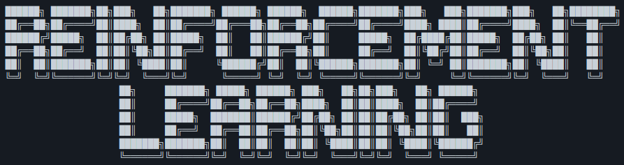

# GreatUniHack 2021


We want you to make something cool with reinforcement learning in a retro style!

## Judging criteria
### Task creativity

Your project will be assessed based on the creativity of the solution / task that the model(s) performs, not the complexity of the model(s) behind it. If you need to (or want to!) use something complex like state-of-the-art Deep RL neural nets, go for it. However, simple AI solutions can solve facinating problems just as well!

### Retro theme
We suggest the idea of a retro theme, but two things:
1. Retro doesn't just mean retro video games. Retro could mean overly complex last-centuary mechanical interfaces, old game consoles or historical sports (We're a big fan of [Tudor Football](https://primaryfacts.com/680/tudor-football-facts-and-information/))

2. Even more, we are looking for innovative reinforcement learning applications. If your idea isn't retro, you can still impress us!

## Places to start

Try these for an introduction to RL: [GeeksforGeeks](https://www.geeksforgeeks.org/what-is-reinforcement-learning/), [towards data science](https://towardsdatascience.com/reinforcement-learning-101-e24b50e1d292)

OpenAI gym provides a bunch of [test environments](https://gym.openai.com/envs/#classic_control) for playing around with RL.
This [PyTorch Deep Q Learning tutorial](https://pytorch.org/tutorials/intermediate/reinforcement_q_learning.html) may be a good starting point for model training.

You can even make your [own environments](https://towardsdatascience.com/creating-a-custom-openai-gym-environment-for-stock-trading-be532be3910e) using the OpenAI library! Here's an interesting snippet from the article:
```python
import gym
from gym import spaces

class CustomEnv(gym.Env):
  """Custom Environment that follows gym interface"""
  metadata = {'render.modes': ['human']}

  def __init__(self, arg1, arg2, ...):
    super(CustomEnv, self).__init__()
    # Define action and observation space
    # They must be gym.spaces objects
    # Example when using discrete actions:
    self.action_space = spaces.Discrete(N_DISCRETE_ACTIONS)
    # Example for using image as input:
    self.observation_space = spaces.Box(low=0, high=255, shape=
                    (HEIGHT, WIDTH, N_CHANNELS), dtype=np.uint8)

  def step(self, action):
    # Execute one time step within the environment
    ...
  def reset(self):
    # Reset the state of the environment to an initial state
    ...
  def render(self, mode='human', close=False):
    # Render the environment to the screen
    ...
```

Feel free to a look at other Reinforcement Learning libraries (it doesn't have to be Python), there are plenty out there.   

# More Inspiration
* Want to pit your bot against itself or play against your bot? Try [Simple](https://github.com/davidADSP/SIMPLE). The creator has written a great [article](https://medium.com/applied-data-science/how-to-train-ai-agents-to-play-multiplayer-games-using-self-play-deep-reinforcement-learning-247d0b440717) about it!
* Want to use real hardware agents? Check out [this hack](https://hackaday.com/2019/05/25/little-lamp-to-learn-longer-leaps/) by Roger Cheng.
* Want to be REALLY ambitious try using human preference to evaluate your AI like [this](https://openai.com/blog/deep-reinforcement-learning-from-human-preferences/). (P.S: This would be really hard)
* Check out [itch.io](https://itch.io/game-assets/free/tag-retro) for some nice retro assets.
